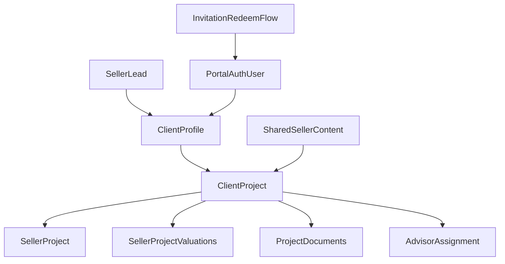

# Seller Client Space Design Note

## Scope
This note turns the current redesign plan into a concrete product and architecture baseline for the seller client space.

It is intentionally design-first:
- no implementation decisions are treated as final until the vendor docs are reviewed
- the current `staging` work is treated as reusable inventory, not as the target solution
- phase 1 is seller-only, while preserving a future cross-vertical client-space model

## Working assumptions
- One Sillage client space will eventually host seller, buyer, rental, and wealth journeys.
- The first production-grade portal must focus only on the seller journey.
- The current repo already contains useful foundations:
  - seller lead funnel, scoring, Loupe valuation, AI chat
  - admin-side client/project/seller-project model
  - SweepBright property sync and media ingestion
- The current repo now contains a first seller portal slice:
  - `app/espace-client/login`
  - `app/espace-client/invitation`
  - `app/espace-client`
  - `app/espace-client/projets/[projectId]`
  - seller auth linking via `app/espace-client/auth/confirm/route.ts`

## Baseline inventory

### Reusable foundations
- Seller funnel and estimation:
  - `services/sellers/seller-lead.service.ts`
  - `services/sellers/seller-score.service.ts`
  - `services/sellers/seller-chat.service.ts`
  - `services/valuation/loupe-client.ts`
  - `services/valuation/loupe-valuation.service.ts`
- Seller CRM and project model:
  - `services/clients/client-profile.service.ts`
  - `services/clients/client-project.service.ts`
  - `services/clients/seller-project.service.ts`
  - `services/clients/client-project-invitation.service.ts`
  - `db/migrations/20260318_015_create_client_space_lot1.sql`
  - `db/migrations/20260319_016_harden_client_space_invariants.sql`
- External real-estate integrations:
  - `services/properties/sweepbright-client.service.ts`
  - `services/properties/sweepbright-sync.service.ts`
  - `services/properties/sweepbright-media-cache.service.ts`

### Confirmed missing or incomplete product surfaces
- The seller portal exists, but still needs phase-1 hardening on admin invitation operations and seller session UX.
- Invitations now point to `/espace-client/invitation?token=...` and the acceptance flow exists through `app/espace-client/auth/confirm/route.ts`.
- The seller auth flow is now separated from the admin Google callback.
- No seller document vault exists.
- No real appointment scheduling integration exists.
- No shared seller news/content module exists.
- No MyNotary integration exists in the codebase.

## Current implementation status

### Already implemented in code
- Seller login by email magic link:
  - `app/espace-client/login/page.tsx`
  - `app/espace-client/_components/seller-magic-link-form.tsx`
- Invitation redemption:
  - `app/espace-client/invitation/page.tsx`
  - `services/clients/client-project-invitation.service.ts`
- Seller portal guard and current-session resolution:
  - `lib/client-space/auth.ts`
- Seller dashboard shell and project page:
  - `app/espace-client/page.tsx`
  - `app/espace-client/projets/[projectId]/page.tsx`
- Seller portal read model:
  - `services/clients/seller-portal.service.ts`
- Admin project operations for seller portal rollout:
  - `app/admin/clients/[id]/projects/[projectId]/invite-button.tsx`
  - `app/admin/clients/[id]/projects/[projectId]/assign-advisor-form.tsx`
  - `app/admin/seller-leads/[id]/create-client-space-button.tsx`

### Still to harden in phase 1
- invitation UX in admin without relying on hidden API knowledge
- advisor contact and booking-link visibility in admin
- richer seller landing page when several projects are linked
- seller session comfort (notably sign-out and clearer navigation)
- explicit documentation of the chosen portal access model

## Product goals
The seller client space must:
- give sellers a reason to return regularly
- preserve value before mandate, not only after signature
- make the assigned advisor tangible and reachable
- convert self-service estimation into human expert engagement
- expose trustworthy project progress without leaking internal CRM complexity

## Seller journeys

### Journey A: self-service valuation, pre-mandate
The seller estimates online and creates or reuses a lead.

The portal must let the seller:
- see their latest valuation and its context
- relaunch or request a refreshed valuation after a delay
- contact Sillage or the assigned advisor
- book an in-person valuation if an advisor is assigned
- continue the AI conversation about the project

### Journey B: advisor assignment and first contact
An admin assigns an advisor to the seller project.

The portal must let the seller:
- identify the advisor by name, email, phone, and WhatsApp if available
- understand the next expected step
- book a meeting with the advisor

### Journey C: mandate preparation and signed mandate
The project evolves from valuation to commercial mandate.

The portal must let the seller:
- see the project status change in business language
- access the signed mandate PDF or uploaded substitute
- understand what documents are still missing

### Journey D: active commercialization
The property is live and the seller expects updates.

The portal should let the seller:
- see property media and publication context
- access high-level commercial reporting if technically available
- receive curated project updates and helpful real-estate content

### Journey E: dormant reactivation
The seller does not convert immediately or comes back after months.

The portal should let the seller:
- refresh the valuation
- rediscover the assigned advisor or agency contact
- receive reminder emails tied to valuation staleness or pending next steps

## Requirement matrix

| Requirement | Business value | Data needed | Source of truth | API feasibility today | Fallback if API is unavailable | Admin impact | Security impact |
| --- | --- | --- | --- | --- | --- | --- | --- |
| Valuation history | Bring the seller back and justify account value before mandate | valuation result, valuation date, valuation inputs, refresh history | today: `seller_leads` metadata and `estimated_price`; target: dedicated `seller_project_valuations` table | Loupe estimate retrieval is proven; history is not modelled yet | keep latest valuation plus manual refresh events until versioned history exists | admin can trigger sync and see freshness | client must only read valuations tied to their own project |
| Comparable properties behind valuation | Make the estimate explainable and increase trust | comparable properties, scoring or rationale, timestamps | likely Hubim `address-analysis` via `mutationSearch` and `adSearch` plus exported comparable items | partially supported: Hubim docs expose comparable-sale and comparable-ad search models, but no seller-ready endpoint contract has been validated yet for direct portal rendering | show valuation range and explanation text only until the exact comparable payload is confirmed in real responses | admin may need a toggle if comparables are noisy or incomplete | comparables should be sanitized and read-only |
| Refresh valuation after delay | Reactivate dormant sellers | staleness date, last refresh timestamp, reminder cadence | target: valuation table + reminder rule | Loupe estimate API is proven; automation is not built | manual refresh CTA in portal; admin-triggered refresh | admin may configure cadence and exceptions | refresh must be rate-limited and linked to the right seller |
| Advisor assignment and contact | Turn anonymous funnel into relationship | assigned advisor, advisor contact fields, assignment history | `seller_projects.assigned_admin_profile_id`, `seller_project_advisor_history`, `admin_profiles` | already supported in back office | if no advisor assigned, show generic agency contact | admin needs assignment UI and history visibility | seller can see only their current advisor and safe history |
| Direct contact by email / phone / WhatsApp | Reduce friction and increase conversion | advisor channels, fallback agency channels | `admin_profiles` plus optional channel metadata | email/phone are feasible now; WhatsApp is not implemented | start with email + phone; add WhatsApp once channel ownership is defined | admin profile needs structured contact fields | client should only see approved business contact channels |
| Physical valuation appointment | Move from estimation to mandate | appointment link, availability, scheduled status, meeting metadata | target: appointment provider or Sillage scheduling model | only `appointment_service_url` from SweepBright is seen; no real scheduling integration is present | external booking link per advisor or generic request form | admin must define advisor bookable links | appointment links must not expose unrelated internal data |
| AI assistant in portal | Keep the seller engaged and guide toward advisor contact | threaded messages, seller context, project state | today: `seller_leads.metadata.seller_chat`; target: project-scoped conversation store | seller AI chat exists pre-login; portal chat is not yet modelled | reuse existing AI guidance with project context later; phase 1 can link from valuation summary to advisor CTA | admin may need transcript visibility rules | conversation data is personal and must be project-scoped |
| Real-estate news feed | Create recurring usage beyond transaction steps | articles, categories, publication dates, possibly AI drafts | target: editorial/news module | not present | start with static curated content or weekly agency digest | admin/editorial review workflow needed | all sellers can see shared news; no tenant risk if content is generic |
| Mandate status visibility | Make project progress legible | mandate status, project status, timestamps | `seller_projects.project_status` and `mandate_status` | already modelled in schema | if MyNotary is unavailable, still show mandate status as internal milestone | admin needs a clean status transition workflow | seller sees only their project timeline |
| Signed mandate PDF | Reduce email back-and-forth and centralize trust documents | PDF file, document metadata, upload source, visibility rules | target: document vault, optionally MyNotary API | not supported from the provided docs: no PDF/document/signature endpoint has been identified yet | manual upload by advisor/admin into secure storage | admin needs upload and replace actions | documents must be private and access-controlled per project |
| Seller legal document vault | Reduce friction and accelerate mandate execution | uploaded files, document types, versioning, review status | target: project document model and storage bucket | not implemented | manual upload in admin as interim, then seller self-upload | admin needs validation and missing-doc checklist | strict file-level authorization and audit are required |
| Buyer interest / visits / comments from CRM | Give seller operational transparency | counts, timestamps, visit notes/comments, lead interactions | possibly SweepBright, if exposed | not supported by the Website API docs provided: seller-reporting endpoints for visits/comments were not identified | phase 1 shows only status and agency-authored updates | admin may need a manual summary input if API is absent | comments may contain sensitive third-party data and need filtering |
| Invitation-based access | Securely convert CRM seller into real portal user | invite token, email, acceptance state, auth link | `client_project_invitations`, `client_profiles.auth_user_id` | invitation creation exists; acceptance flow does not | email magic link or manual admin onboarding as temporary fallback | admin needs resend, revoke, and audit tools | current implementation is not safe enough for public rollout |
| Reminder emails every 3 months | Drive reactivation | cadence, last valuation date, last email date, opt-out | target: reminder campaign table + job | not implemented | manual campaigns until automated reminders are built | admin needs campaign visibility and stop rules | mail triggers must respect consent and project ownership |

## API feasibility audit

### SweepBright
Confirmed from current code and public documentation:
- estate retrieval
- publication URL feedback
- public media/documents exposure
- `appointment_service_url` on estates
- general and owner lead creation through `/contacts` and `/contacts/owners`
- no endpoint to fetch all published properties proactively; data is intended to be consumed after publication webhooks
- the custom website is expected to cache property data and public files locally

Not proven yet for the seller client space:
- number of buyer contacts per property
- number of visits
- visit comments or feedback
- owner-facing commercial reporting endpoints

Conclusion:
- SweepBright is already a solid source for property data and publication context
- SweepBright is not yet a validated source for seller reporting KPIs
- do not architect the seller dashboard around visit/contact metrics until the vendor docs confirm them

### La Loupe
Confirmed from current code and the provided Hubim docs:
- address search
- place tree resolution
- sale estimate computation
- address analysis retrieval
- lead retrieval and admin sync
- `address-analysis` models explicitly contain:
  - `mutationSearch` for comparable sale search
  - `adSearch` for comparable ad search
  - `export` metadata
  - `exportedItems` / `exportedItemsWithDetails` fields inside comparable search schemas
- Hubim also exposes `property-deal`, `property-deal-note`, and `task` endpoints that could be useful for CRM synchronization or richer internal workflows

Not proven yet:
- the exact response shape needed to expose comparable properties safely in the seller portal
- whether exported comparable items can be retrieved with enough detail for client-facing rendering
- retrieval of a seller-ready valuation rationale beyond ranges and comparable search metadata

Conclusion:
- Loupe can power valuation capture and refresh
- Loupe comparables are no longer “unknown”; they are best treated as `partially supported`
- comparables should still be treated as optional enrichment, not as a phase-1 dependency, until real payload validation is done

### MyNotary
Current status:
- no integration exists in the repo
- the provided Hubim API reference does not show explicit MyNotary endpoints for signed contracts, PDFs, signatures, or document retrieval

Conclusion:
- phase 1 must assume a manual upload fallback for signed mandates
- API-based mandate retrieval cannot be planned as supported with the current documentation set

## Target domain model

### Keep and refine
- `client_profiles`
- `client_projects`
- `seller_projects`
- `project_properties`
- `seller_project_advisor_history`
- `client_project_events`

### Add or redesign
- `seller_project_valuations`
  - versioned valuations per seller project
  - source, valuation range, refresh metadata
- `client_project_memberships` or equivalent access model
  - if the portal later supports multi-user households
- `client_project_documents`
  - mandate PDF, diagnostics, title deed, tax files, uploads
- `client_project_document_requests`
  - missing-doc checklist and review state
- `client_project_reminders`
  - scheduled nudges, sent timestamps, stop reasons
- `client_project_conversations`
  - if portal AI or advisor messaging is persisted per project
- `client_project_news_views` only if personalized content tracking is desired

### Do not keep as-is
- `seller_projects.latest_valuation_id`
  - the idea is useful
  - the current field is not wired and is too weak without a valuation history table

## Security model

### Current risk
The original lot-1 client-space rollout was not portal-safe:
- `db/migrations/20260318_015_create_client_space_lot1.sql` originally allowed blanket `authenticated` access
- the first invitation concept existed before the public seller auth flow was complete
- admin and seller auth concerns were initially mixed

The repo now contains a hardening migration:
- `db/migrations/20260326_017_secure_client_space_portal_rls.sql`

Phase 1 should still be treated as BFF-first in practice:
- portal reads already happen through server-side services backed by `supabaseAdmin`
- seller-facing pages should continue to rely on guarded server reads even though row-scoped select policies now exist

### Target model
- admin access continues through service-role-backed server code
- seller portal access must be identity-bound:
  - invitation token is redeemed server-side
  - the seller authenticates with the expected email/provider
  - `client_profiles.auth_user_id` is linked to that user
- client RLS must be row-scoped:
  - client sees only their `client_profile`
  - client sees only related `client_projects`
  - child data is accessible only through those projects
- invitation secrets must never be queryable by normal authenticated users

## Recommended portal architecture

Principles:
- keep admin operations server-side
- treat invitation redemption as a first-class workflow
- separate project state from content and communications
- design for reuse across future buyer/rental/wealth spaces without forcing them into phase 1

## Delivery phases

### Phase 0: feasibility and cleanup
- review private vendor docs for SweepBright, La Loupe, and MyNotary
- decide which current `staging` assets are retained
- freeze any portal rollout until security is redesigned

### Phase 1: seller portal access core
- invitation redemption flow
- seller auth linking
- portal-safe RLS and BFF-backed reads
- seller dashboard shell
- advisor contact card
- latest valuation block

Current state:
- most of this phase already exists in code
- the remaining work is phase-1 hardening, not greenfield delivery

### Phase 2: pre-mandate value loop
- valuation history
- valuation refresh CTA
- reminder engine
- seller-facing AI conversation scoped to project

### Phase 3: active mandate and documents
- mandate status and timeline
- signed mandate access
- secure document vault
- document request checklist

### Phase 4: advanced engagement
- appointment booking integration
- shared seller news feed
- SweepBright KPI widgets only if APIs are proven
- optional comparables display from Loupe if the API allows it

## Salvage vs discard from current staging

### Salvage
- seller lead funnel and CRM
- Loupe integration for valuation
- SweepBright estate/media ingestion
- core client/project/seller-project domain tables
- advisor history model
- client project event model
- admin client/project management screens as internal tooling

### Discard or rewrite
- blanket client-space RLS from the first lot-1 migration
- any admin-only auth callback assumption for seller access
- any portal design that depends on unverified SweepBright KPIs
- any portal design that depends on Loupe comparables before docs confirm them

### Rework, not discard
- invitation tables and tokens
- `client_profiles.auth_user_id`
- `seller_projects.latest_valuation_id`
- seller project statuses and mandate statuses

## Recommended product decisions
- Phase 1 should not promise seller-facing visit counts or visit comments.
- Phase 1 should not depend on MyNotary.
- Phase 1 should not depend on WhatsApp unless advisor channel ownership and compliance are defined.
- Phase 1 should focus on:
  - secure access
  - advisor relationship
  - valuation visibility
  - mandate readiness

## Open validation points awaiting vendor docs
- What are the real response payloads returned by Hubim for `address-analysis` when comparable items are exported?
- Is there another MyNotary-specific documentation set beyond the provided Hubim reference?
- Can SweepBright expose seller-reporting KPIs outside the Website API docs currently available?
- Does Sillage want one seller login per client profile, or potentially multiple household members later?
- Does Sillage want appointments managed through a third-party scheduler or manually requested from the advisor?

## Decision
The current `staging` work should not be hard-reset blindly.

A better path is:
- keep the reusable domain and integration foundations
- treat the existing seller portal slice as audited inventory already worth preserving
- explicitly harden the remaining incomplete admin and seller UX pieces
- restart only the unresolved parts of the seller client space as a fresh implementation track on top of audited foundations

This gives a cleaner result than rewriting everything from zero, while still avoiding the trap of trying to ship the current portal scaffolding as-is.
